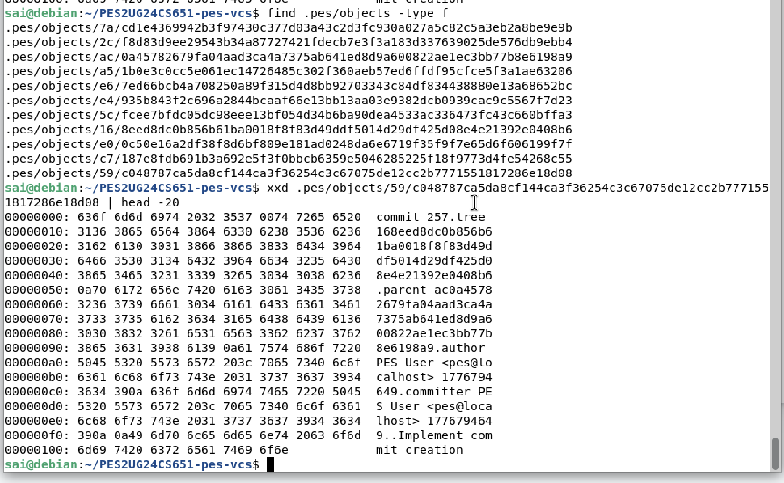

# PES-VCS Lab Report

**Name:** Sai Pranav Reddy  
**SRN:** PES2UG24CS651  
**GitHub Repository:** [https://github.com/SaiPranavRedy/PES2UG24CS651-pes-vcs](https://github.com/SaiPranavRedy/PES2UG24CS651-pes-vcs)

---

## Phase 1: Object Storage Foundation

In this phase, I implemented content-addressable object storage using SHA-256 hashing.  
Objects are stored inside `.pes/objects` using sharded directories, and object integrity is verified during reads.

### Screenshot 1A: `./test_objects` Output

### Screenshot 1B: `.pes/objects` Directory Structure

---

## Phase 2: Tree Objects

In this phase, I implemented tree construction from the index to represent directory snapshots.  
Tree objects store file and directory entries using modes, names, and object hashes.

### Screenshot 2A: `./test_tree` Output

### Screenshot 2B: Raw Object Using `xxd`

---

## Phase 3: Index / Staging Area

In this phase, I implemented index loading, saving, and file staging.  
The index stores staged file metadata including mode, blob hash, modification time, size, and path.

### Screenshot 3A: `pes init`, `pes add`, and `pes status`

### Screenshot 3B: `.pes/index` Contents

---

## Phase 4: Commits and History

In this phase, I implemented commit creation using the staged index and generated root tree object.  
Each commit stores tree hash, parent commit, author, timestamp, and commit message.

### Screenshot 4A: `./pes log` Output

### Screenshot 4B: `.pes` Files After Three Commits

### Screenshot 4C: HEAD and Branch Reference

---

## Final Integration Test

The final integration test verifies repository initialization, staging, committing, logging, reference updates, and object store creation.

### Screenshot: `make test-integration`

---

## Analysis Questions

### Q5.1: Implementing `pes checkout <branch>`

`pes checkout <branch>` would first check whether `.pes/refs/heads/<branch>` exists. If it exists, `.pes/HEAD` would be updated to contain `ref: refs/heads/<branch>`.

After updating HEAD, PES-VCS would read the commit hash from that branch, load the commit object, load its root tree, and update the working directory to match that tree snapshot.

### Q5.2: Dirty Working Directory Detection

A dirty working directory conflict can be detected by comparing tracked files in the working directory with the index. PES-VCS can check file size, modification time, and, if needed, rehash file contents and compare them with the stored blob hash.

If a tracked file has uncommitted changes and the target branch contains a different version of that file, checkout should refuse to continue to avoid overwriting user work.

### Q5.3: Detached HEAD

Detached HEAD means `.pes/HEAD` stores a commit hash directly instead of pointing to a branch reference. New commits can still be created, but no branch name automatically points to them.

The user can recover those commits by creating a new branch file inside `.pes/refs/heads/` containing the detached commit hash, or by updating an existing branch to point to that commit.

### Q6.1: Garbage Collection

Garbage collection would start from all branch references in `.pes/refs/heads/` and mark every reachable commit. From each commit, it would recursively visit its tree objects, subtrees, and blob objects.

All reachable hashes can be stored in a hash set. After that, PES-VCS can scan `.pes/objects` and delete objects whose hashes are not present in the reachable set.

### Q6.2: Concurrent Garbage Collection Risk

Garbage collection is dangerous during a commit because the commit process may write new objects before updating the branch reference. During that gap, GC may think the new objects are unreachable and delete them.

Git avoids this type of race using locking, temporary object protection, and grace periods before deleting unreachable objects.
